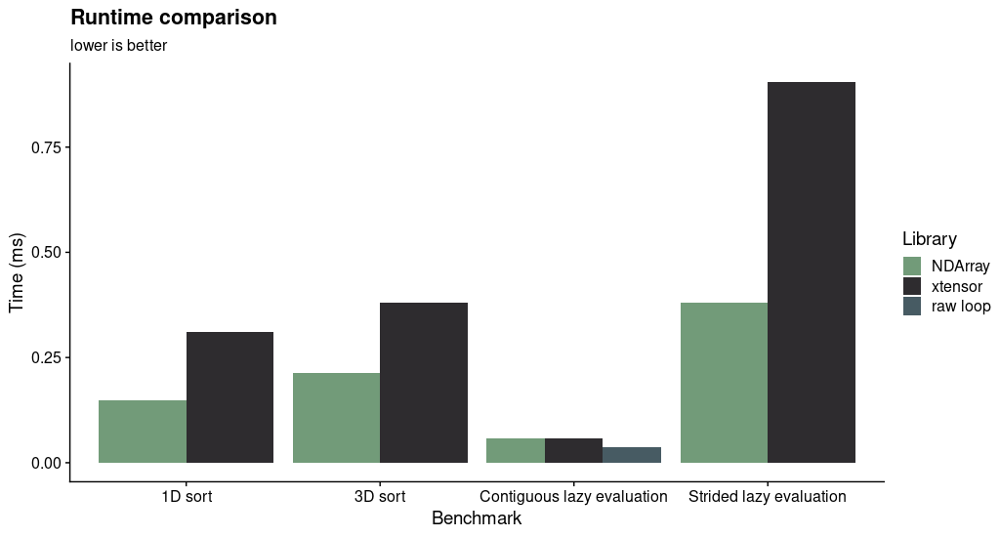

# NDArray
This is a small header only library aimed to provide a c++ n-dimensional tensor with access
and splice methods as close as possible to python numpy arrays, while providing compatibility with the STL through
random access iterators.

# Benchmark
The performance of the library  is evaluated against 
[xtensor](https://github.com/xtensor-stack/xtensor), a well established library with similar 
features. An intel i7-7700k CPU, the GCC 10.2.0 compiler, and `-O3 -DNDEBUG -march=native` flags were used. 



The sort tests involve sorting a 1D view of a 2D array or a 3D view of a 5D array.
The "Contiguous lazy evaluation" involves computing and storing a compound operation over an entire 
array, while the "Strided lazy evaluation" test performs the computation over a 3D view of a 5D array.
The computation over a contiguous range is also compared against a standard c++ raw loop.

The performance of the two library is similar when evaluating functions over entire arrays stored
contiguously in memory, but when iterators over array views are used, NDArray outperforms xtensor 
by a wide margin.

# Requirements
A c++20 compiler, like GCC 10, is required. The library uses concepts to improve readability.
A backport to c++17 might be available in the future.
 
# Installation
The library is headers only, and only the folder `ndarray` needs to be copied to the include path.
Alternatively `cmake .; make; make install` will do the trick. Tests are optionally built with cmake 
and Google's gtest and benchmark libraries. 
 
# Examples
Arrays are created by passing the contained type and the number of dimensions.
```
nd::NDArray<int, 4> arr(5, 5, 5, 5); // Creates a 4D dimensional array of integer with 5^4 elements. 
```  
Alternatively a brace initialization list with every element can be used:
```
nd::NDArray<int, 2> matrix{{0, 1}, {2, 3}, {4, 5}};
```

values can be accessed either by index,  `[]` for the linear index, `()` for Cartesian index, 
or through iterators. Assignments from scalars are broadcasted to the entire array.

```
arr = 1; // All elements are 1.
std::iota(arr.begin(), arr.end(), 0); // A continuos range of values 0, 1, 2... is assigned to 'arr'.
arr(1,2,3,4) = 42; // Assignment to single location.
std::cout << arr; // Prints the array. 
```

## Slicing and views
Like with python, providing a range of indices, or fixing them across some dimensions, provide a view
to the original data of dimension equal or lesser. Unfortunately there is no `:` operator in c++,
so a range will have to be provided as `nd::range{start, end}` representing the semi open interval
`[start, end)`. The token `nd::end` is used to mark the end of the original range, and `nd::all`
is short hand for the entire range. Selecting a negative index or range end means counting from the end,
like in python. E.g `nd::range{0, -1}` takes all elements but the last one.

```
nd::NDArray<float, 3> tensor(3,3,3); // 3D tensor
auto m = tensor(-1, nd::range{1, nd::end}, nd::all); // 2x3 matrix with the first index of 'tensor' fixed to 2. 
m.shape(); // std::array with elements {3, 3}
``` 

STL algorithms can be used both on arrays and views.

```
auto column = m(nd::all, 0); // first column
std::sort(column.begin(), column.end());
```

Views and arrays of the same shape can be assigned to each other. 
```
m(0, nd::all) = column; // assign column to row.
```

The token `nd::newaxis` can be used to obtain a view of higher dimension than the original array.
The new axis have length of 1.
```
nd::NDArray<int, 2> m(3,5);
nd::NDView<int, 4> m_view = m(nd::all, nd::newaxis, nd::all, nd::newaxis);
```
 

## Broadcasting
Lazy evaluations of arithmetic operators `+, -, *, /` is supported between tensors
of the same shape, scalars, and tensors whose shape is broadcastable with the same rules as `numpy`. 
The result is evaluated when assigned to an array or view.  


```
// Initialize A, B, C tensors of dimension >= 3 and compatible shape
C(0, nd::all, nd::all) = (A(nd::all, -1, nd::all) + B(nd::all, nd::all, -1)) / 2.;
```

```
// compute tensor product of two matrices
using namespace nd;
NDArray<float, 2> A(3, 3);
NDArray<float, 2> B(3, 3);
NDArray<float, 4> AB;

AB = A(all, all, newaxis, newaxis) * B;
```


Alternatively arbitrary functions can be broadcasted to an arbitrary number of tensors of the same 
shape with the `broadcast` and `broadcastIndex` functors:

```
nd::NDArray<float, 3> A(3,3,3), B(3,3,3), C(3,3,3);
/* A = ..., B = ...;  initialize values. */
// Apply C = A*A - B elementwise.
nd::broadcast([](float a, float b, float& c){ c = a * a + b;}, A, B, C);

```

```
// Use the value of the indices (stored in a std::array) to perform operations.
nd::broadcastIndex([](float& a, auto& index){ a = index[0] + index[1] + index[2];}, A);
```

# Bound checking
The matching of shapes during the evaluation of a lazy function, or the validity of indices and 
ranges, is checked through assertions when the flag `-DNDEBUG` is not defined. 
